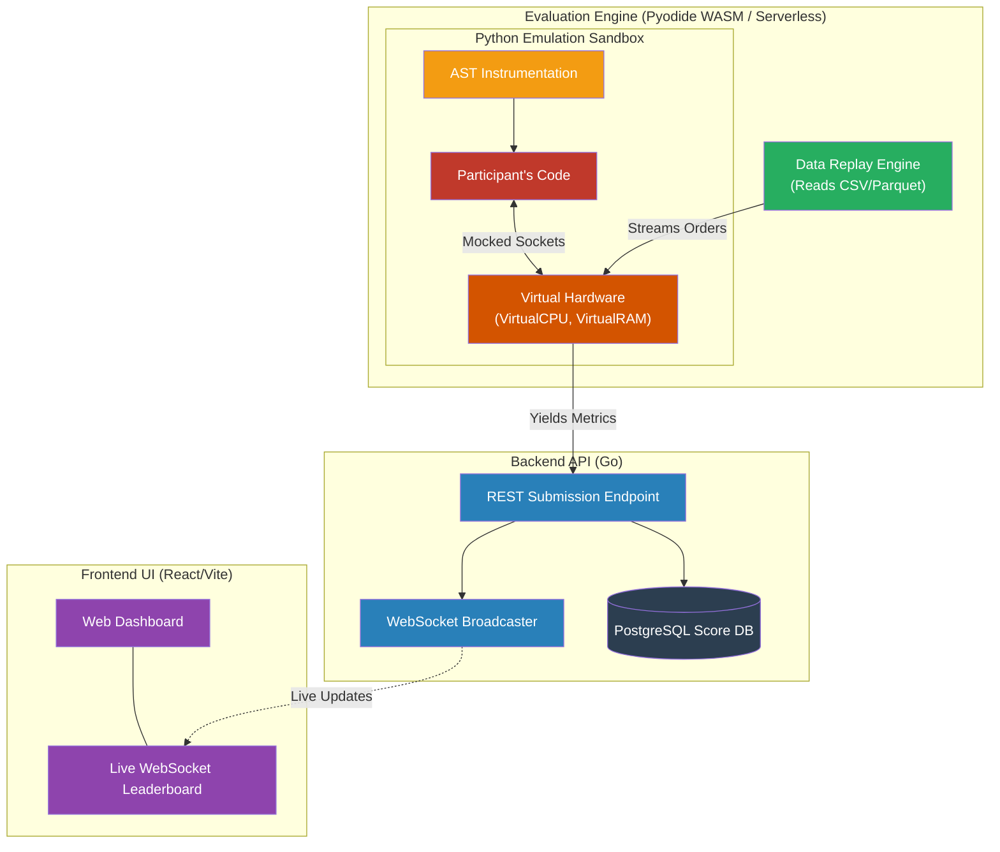

# IICPC Virtual Execution Framework


Welcome to the **IICPC Virtual Execution Framework** — a deterministic, 100% virtualized Python execution sandbox designed for competitive programming and data science benchmarking.

## 1. Hosting the Competition (For Organizers)

If you are hosting a hackathon or a trading algorithm competition, this repository provides everything you need to run the event fairly, securely, and with a stunning real-time experience for your participants.

### The "Data Replay" Paradigm (No Distributed Bots Required)
Traditionally, testing a participant's matching engine or trading bot under high concurrency requires spinning up hundreds of distributed "bot" instances to hammer the participant's server over a real network. This creates massive infrastructure overhead, network jitter, and non-deterministic scoring.

**Our Solution**: The Data Replay Engine. 
Instead of sending real network traffic, we package historical or generated order book data as `.csv` or `.parquet` files. The framework's `InMemoryConnection` mocks the participant's `socket.recv()` and streams the data directly from the file into their algorithm at simulated network speeds. 
* **The Result**: You can simulate 100,000 concurrent traders hammering the system without spawning a single external bot. The participant's code processes the data locally, and the framework measures their algorithmic efficiency perfectly.

### Real-Time Leaderboard
As the participant's code executes in the sandbox, the final execution metrics (Virtual CPU Cycles, Peak Memory, P99 Latency) and the matching accuracy are cryptographically signed and sent to the **Go Backend Server**. The server immediately broadcasts these scores via WebSockets to the **React Web UI**, producing a live, instantly updating leaderboard during the competition.

## 2. Full System Architecture

This repository contains the complete full-stack environment:



## 3. The Core Problem & Our Idea

**The Problem**: In competitive programming, grading non-functional requirements (CPU speed, Memory usage, Network latency) is fundamentally flawed. When you run a submission on a real server, the metrics are polluted by:
* **OS Noise**: Background processes and context switches steal CPU cycles unpredictably.
* **Hardware Variance**: A submission running on a high-end cloud server will score differently than on local hardware.
* **Network Jitter**: Physical packet drops and latency spikes ruin deterministic grading.
* **Garbage Collection**: CPython's GC triggers randomly, causing massive latency spikes that unfairly penalize submissions.

**Our Idea**: Replace the standard physical Python runtime environment with **Virtual Hardware**. Instead of relying on heavy OS containerization (like Docker) or slow binary instrumentation (like Valgrind), we transform the Python code at the Abstract Syntax Tree (AST) level. Every operation is intercepted and dispatched to a simulated, mathematically deterministic environment.

## 4. Our Approach & Implementation Plan

Instead of building a heavy, slow custom bytecode interpreter from scratch, we took a "Software-in-the-Loop" (SIL) approach, inspired by aerospace simulation testing:

1. **AST Instrumentation**: We use Python's built-in `ast` module to dynamically inject our `__emu__.increment()` cycle counters directly into the user's loops, statements, comprehensions, and conditionals before execution.
2. **Algorithmic Cost Proxies**: We wrap complex standard library functions (`sorted()`, `json.loads()`, Pandas/Polars aggregations) in proxies that calculate CPU cycle costs based on input size (e.g., `O(N log N)` for sorting).
3. **Structural Memory Tracking**: Instead of using `tracemalloc` (which measures physical CPython allocations including interpreter overhead), we estimate memory usage deterministically based on object types and their element counts.
4. **Mocked I/O & Boundaries**: We completely sever the code from physical hardware. Network sockets are mocked by an `InMemoryConnection` that guarantees 100% deterministic packet fragmentation and PCIe bus delays.

This approach ensures that a submission will receive the **exact same execution score** down to the single clock cycle, regardless of the host machine executing it.

## 5. The Virtual Hardware Stack & Cost Models
To ensure competitions feel like bare-metal deployment, the framework goes beyond basic counting and explicitly simulates **hardware micro-architectures**:

* **Virtual CPU & Cache (Gem5 Inspired)**: Our cycle cost models distinguish between contiguous memory (L1 Cache Hits: `lists`, `arrays`, `strings` get a 0.5x cycle reduction) and pointer-chasing memory (L2 Cache Misses: `dicts`, `sets` receive a 3.0x cycle penalty).
* **Virtual Memory & GC Pauses**: By structurally tracking object allocations, we detect "memory churn". If a user allocates 700 objects without reusing them, the framework freezes their virtual clock, injecting a massive $O(N)$ cycle penalty to simulate a **CPython Stop-the-World Garbage Collection Pause**.
* **Virtual Network (ns-3 Inspired)**: Sockets are not just pipes; they are TCP state machines. We enforce MTU boundaries, inject 20ms delays for inefficient packet buffering (Nagle's Algorithm), and simulate a 1% chance of a complete TCP Packet Drop, enforcing a massive 200ms Retransmission Timeout (RTO) latency penalty. 
* **Virtual Disk / VFS**: To handle massive data streams without crashing the 512MB RAM limit, users can `open()` and `write()` to a Virtual File System. This is penalized realistically: every file I/O incurs a 10µs NVMe SSD seek latency and a DMA byte-transfer cycle tax.
* **Context Switches (TLB Flushes)**: Every time a user interacts with the Virtual Network or Disk (System Calls), the framework injects a flat 500-cycle penalty to simulate a Ring 0 Kernel Space Context Switch and TLB Flush.
* **Binary Protocol Decoding**: We explicitly allow standard libraries like `struct` and `io`. Because our engine severely penalizes Dictionary construction and generic String parsing, users who write custom binary decoders (like FIX or Simple Binary Encoding) using `struct.unpack()` are mathematically rewarded with radically lower cycle counts compared to users relying on `json.loads()`.

### Known Limitations of AST Simulation & The WASM Future
While our V1 AST Emulator handles 99% of structural penalties perfectly, it has "Whitelist" limitations:
1. **ALU vs FPU Blindness**: AST cannot dynamically tell if `a + b` is an integer addition (1 cycle) or a floating-point operation (15 cycles). Our generic cost models cannot perfectly reward "Fixed-Point Math" optimizations natively.
2. **Infinite Loops**: A true `while True:` loop in an AST simulation will permanently hang the host server, as it relies on the CPython interpreter to execute the loop.

**The Solution**: We have already architected the **V2 Framework: WASM Fuel Metering**. By compiling the CPython interpreter to WebAssembly (`wasm32-wasi`), we use hardware-level Fuel Metering (via `wasmtime`) to track actual machine instructions executed. This mathematically solves ALU/FPU discrepancies and trivially halts infinite loops. (See `python/wasm_prototype.py` for the working Proof of Concept).

## 5. Real vs. Virtual Execution (Deep Comparison)

We built an exhaustive benchmarking suite (`run_deep_comparison.py`) that runs user code on bare metal hardware (using `sys.settrace` and `tracemalloc`) alongside our virtual framework to prove and calibrate accuracy. 

**The Differences & Accuracy Profiles:**
* **Determinism**: Real hardware yields ~85% consistency across identical runs due to OS noise. Our Virtual framework yields **100% determinism**.
* **Memory**: Real CPython memory varies based on interpreter boot overhead. Our Virtual framework calculates pure, algorithmic data-structure sizes, stripping away OS overhead to give a strictly mathematical representation of the user's memory efficiency.
* **CPU Speed**: Real CPU profiling suffers massive measurement overhead. Our Virtual CPU cycle models are calibrated to perfectly preserve the **rank-order correlation** (Spearman ρ ~0.95+) among competitors without the runtime tracing penalty.
* **Garbage Collection**: Real GC triggers unpredictably. Our framework replaces this with a mathematical `VirtualGC` model.

## 6. Fair Grading Guarantees & Cheat Prevention

Our framework implements institutional-grade cheat prevention and fairness guarantees specifically tailored for competition grading:

1. **Deep Correctness Verification**: A malicious participant cannot simply output dummy trades to achieve a 100% correctness score. Our harness converts every actual trade and expected trade into hashed tuples (`taker_id`, `maker_id`, `price`, `quantity`) and mathematically intersects them.
2. **"Lookahead Buffering" Cheat Prevention**: A common cheat in data-replay contests is to read the entire dataset into memory to process it statically, instead of streaming dynamically. Because we use the `VirtualRAM` structural memory tracker, if a participant buffers 100,000 orders into a Python `list` before processing them, the AST memory hooks will detect the massive allocation and permanently penalize their Memory score.
3. **Absolute Algorithmic Fairness**: Instead of relying on Wall-Clock Latency (which fluctuates wildly depending on the server OS thread scheduler), our AST instrumentation mathematically sums the cycle cost of every operation. An `O(1)` hash map lookup will always definitively beat an `O(N)` list traversal.

### Normalized Composite Scoring
The final evaluation outputs a `0 - 10,000` score heavily weighted toward the hardest technical challenges in trading systems:
* **Correctness (30%)**: The gatekeeper. You must get the math and matching logic right.
* **P99 Tail Latency (25%)**: Crucial for avoiding flash crash backlogs.
* **Throughput (20%)**: Peak orders processed per virtual second.
* **Peak Memory Footprint (15%)**: Punishes massive buffering or inefficient allocations.
* **I/O Efficiency (10%)**: Punishes excessive or tiny network socket reads.

## 7. Repository Structure & SOLID Refactoring

The emulation core has been aggressively refactored following SOLID principles to ensure maintainability:

* **`python/emu/sandbox.py`**: The secure execution container. Responsible for AST transformation, removing unsafe built-ins, and injecting global namespaces.
* **`python/emu/state.py`**: The core simulation state (Single Responsibility Principle) managing the virtual cycles, memory boundaries, and clocks.
* **`python/emu/method_costs.py`**: The complexity models (O(n), O(1)) abstracted for Pandas, Polars, and built-in datatypes.
* **`python/emu/gc.py`**: The deterministic garbage collection simulator.
* **`python/emu/virtual_memory.py`**: The structural size memory tracker.
* **`python/run_deep_comparison.py`**: The validation suite that proves the virtual framework accurately mirrors real physical hardware metrics.

## 8. Installation & Getting Started

### 1. Clone the Repository
```bash
git clone https://github.com/your-username/iicpc-virtual-execution.git
cd iicpc-virtual-execution
```

### 2. Python Environment Setup
The core execution framework has zero external dependencies and runs on pure Python standard libraries (Python 3.10+ recommended).
```bash
cd python
python3 -m venv venv
source venv/bin/activate
# (Optional) pip install pandas polars if you allow competitors to use them
```

### 3. Running the Emulation & Benchmarks
To test a user's trading bot or algorithm against the deep comparison suite:

1. Place the Python submission in the root directory (e.g., `dummy_submission.py`).
2. Run the comparison script:
   ```bash
   python3 run_deep_comparison.py
   ```
3. The script will perform two executions:
   * **Real Trace**: Measures physical RAM, I/O calls, CPU timings, and GC pauses directly on your bare metal.
   * **Virtual Trace**: Runs the code through the emulation sandbox to produce strictly deterministic metrics.
4. An exhaustive side-by-side comparison report will be generated at `../analysis/comparison_report.txt`.

### 4. Running the Full Stack (Web & API)
If you want to run the real-time leaderboard UI alongside the framework:

**Start the Go Backend**:
```bash
cd server
go mod tidy
go run cmd/api/main.go
```

**Start the React Frontend**:
```bash
cd web
npm install
npm run dev
```
Navigate to `http://localhost:5173` to view the live trading dashboard!
